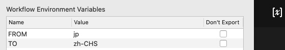
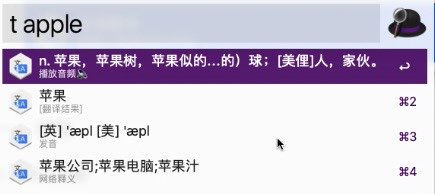

# 翻译保存Anki | Alfred工具

> 使用前请设置有道KEY与SECRET

# 功能特性

1. 语言翻译 （目前支持有道，需自行申请[智云](http://ai.youdao.com)key）
* 自动判断中英文

* 可设置环境变量自定义输入输出语言

[查看有道支持语言](http://ai.youdao.com/DOCSIRMA/html/%E8%87%AA%E7%84%B6%E8%AF%AD%E8%A8%80%E7%BF%BB%E8%AF%91/API%E6%96%87%E6%A1%A3/%E6%96%87%E6%9C%AC%E7%BF%BB%E8%AF%91%E6%9C%8D%E5%8A%A1/%E6%96%87%E6%9C%AC%E7%BF%BB%E8%AF%91%E6%9C%8D%E5%8A%A1-API%E6%96%87%E6%A1%A3.html#section-9)

2. 翻译结果上直接按`enter` 展示详细

3. 按住 `cmd + enter` 在线发声（需要应用绑定语音合成实例）

4. 查询文本保存到anki应用（需开启anki并安装[AnkiConnect](https://ankiweb.net/shared/info/2055492159), 设置Anki相关环境变量）

> 没用过Anki建议先了解其基本概念

> 插件只保存查询文本，不保存翻译文本和语音，建议使用[FastWordQuery](https://sth2018.github.io/FastWordQuery/)批量查询填充其余自定义字段

* `ANKI_DECK` 设置记忆库名称
* `ANKI_MODEL` 设置笔记类型名称
* `ANKI_FIELD` 设置填充字段名称

# 环境变量列表

变量名 | 变量含义
--- | ----
ANKI_DECK | 记忆库名称
ANKI_FIELD | 笔记类型名称
ANKI_MODEL | 填充字段名称
APPKEY | 有道应用KEY
SECRET | 有道应用SECRET
FROM | 翻译源语言代码
TO | 翻译目标语言代码